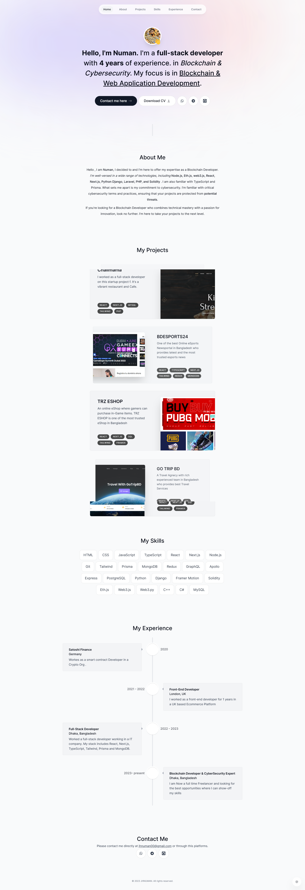

# JHNUMAN.COM - Personal Portfolio Website



Welcome to my personal portfolio website, [JHNUMAN.COM](https://www.jhnuman.com). This website showcases my skills, projects, and experiences as a web developer. It's built with Next.js, a React framework, to provide a fast and dynamic user experience.

## Features

- **Responsive Design**: The website is fully responsive and looks great on various devices, from desktop to mobile.

- **Project Showcase**: Display your projects with details, including descriptions, technologies used, and live demos or GitHub links.

- **About Me**: Share your background, skills, and experiences to introduce yourself to visitors.

- **Contact Information**: Provide ways for visitors to get in touch with you, such as a contact form or social media links.

- **SEO Optimized**: The website is optimized for search engines to improve its visibility in search results.

## Technologies Used

- [Next.js](https://nextjs.org) - A React framework for building fast, server-rendered apps.

- [React](https://reactjs.org) - A JavaScript library for building user interfaces.

- [Styled-components](https://styled-components.com) - CSS-in-JS library for styling components.


## Getting Started

1. Clone this repository:
   ```bash
   git clone https://github.com/numan682/portfolio-v2.git
   cd portfolio-v2

2. Install Dependencies:
   ```bash
   yarn

3. Dev Run:
   ```bash
   yarn dev  

4. Build:
   ```bash
   yarn build  


3. STATIC HTML EXPORT:
   ```bash
   yarn export      

## Contributing
Contributions are welcome! If you find a bug or want to suggest an improvement, please open an issue or submit a pull request.

## License
This project is licensed under the MIT License - see the LICENSE file for details.

## Contact
Feel free to reach out to me through my [Website](https://jhnuman.com) or connect with me on Telegram or WhatsApp.

Thank you for visiting my portfolio website!

   
## 🔗 Links
[](https://jhnuman.com/)
